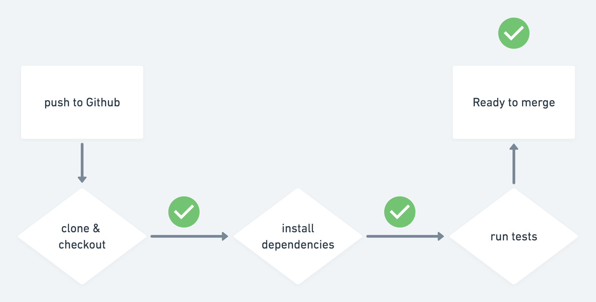

# Tutorial "Introducción a Github actions"

En este tutorial, explico brevemente que son Github actions y como podemos crear nuestro primer workflow. **mira el video: <YOUTUBE_LINK>**

Sigue los pasos del video para poder configurar el workflow en tus proyectos.

## Recursos

- Documentacion oficial Github Actions: https://github.com/features/actions
- GARS (documentacion Github Actions): https://gars.dev/
- Tutorial Original (ingles): https://gars.dev/tutorial/ci-pipeline/
- VIDEO: introduccion a Github actions: <LINK_VIDEO>

---

Cualquier duda o consulta, escribeme por [twitter](https://hhg.link/twitter) o abre una [issue](https://github.com/horacioh/tutorial-github-actions-push-a-netlify/issues/new)!
